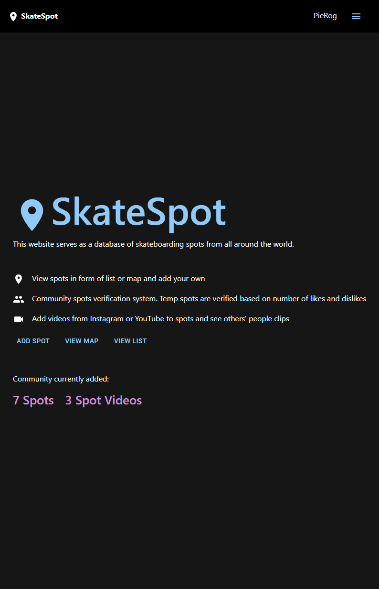
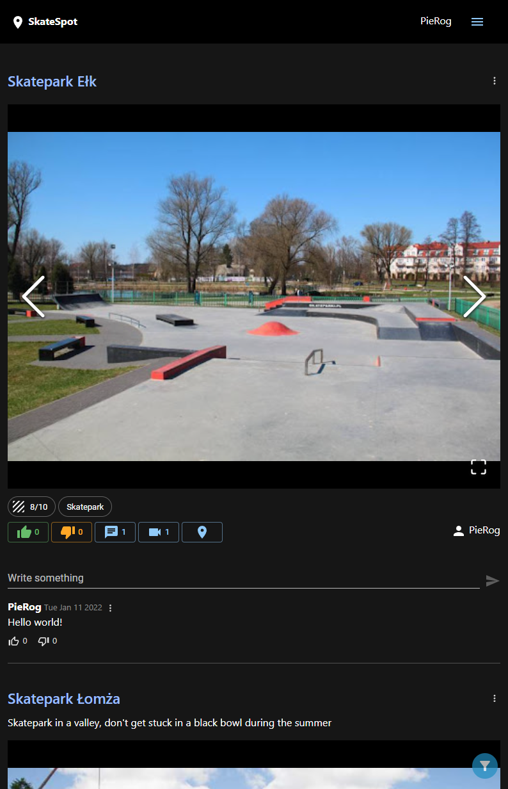
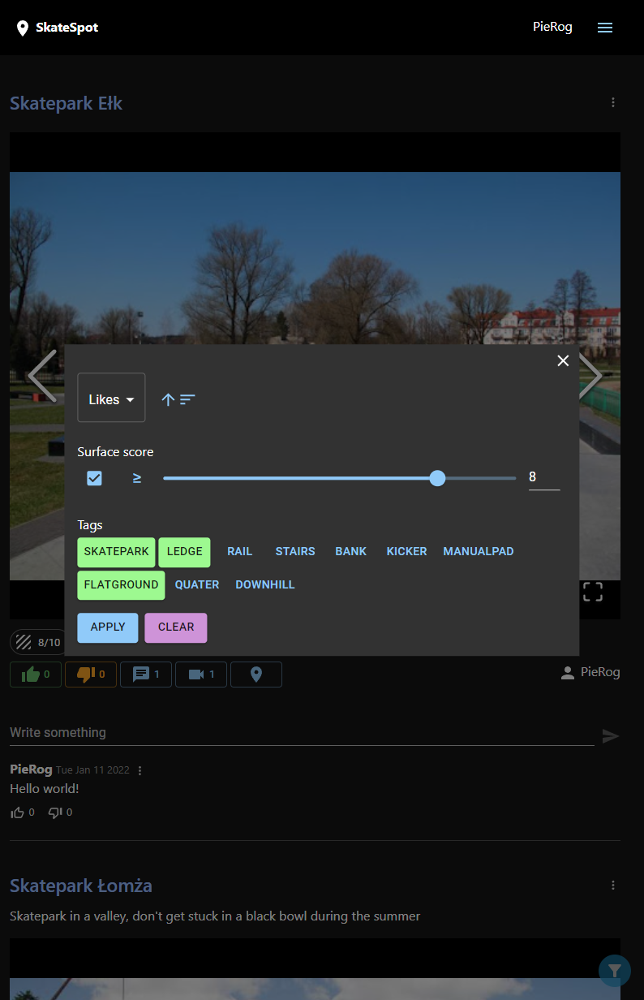
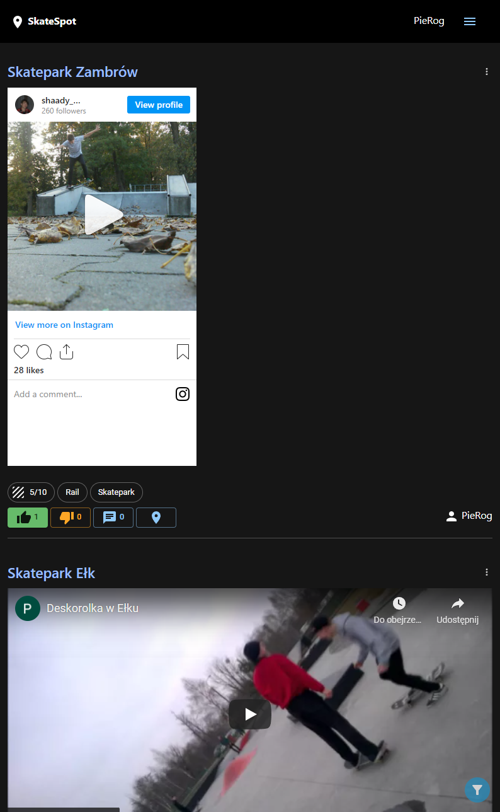
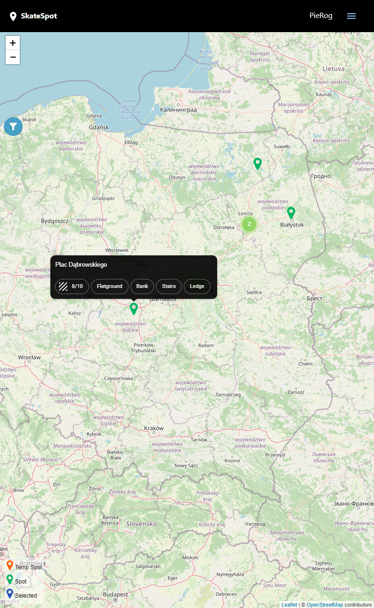
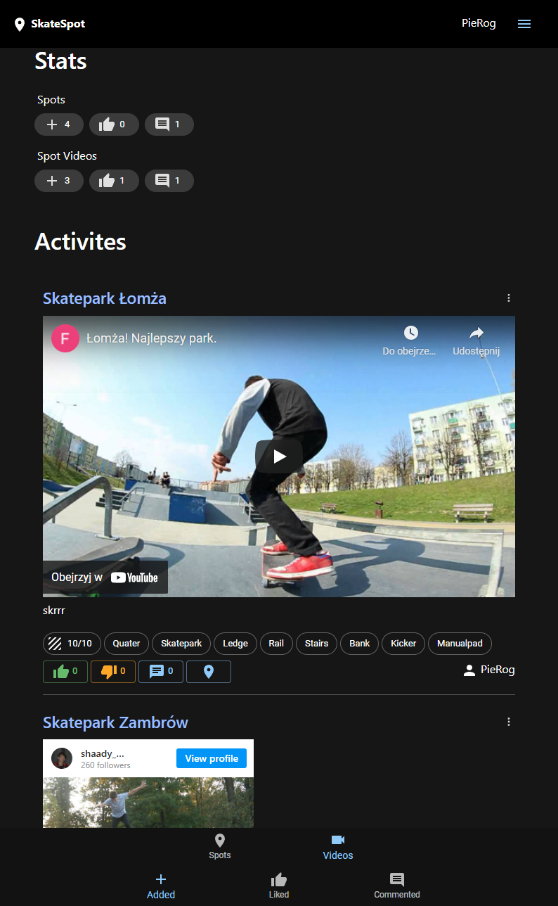

## About The SkateSpot
[SkateSpot](https://shady6.github.io/SkateSpot_v2/#/) is a web application where people can share skateboarding spots and videos. Added spots are verified by community by liking or disliking them. When the spot becomes verified it becomes part of the website and you can attach videos to it. In other case the spot is deleted. You can preview all the spots on a list or on a map. To help you search for spots you can use filtering and sorting.

### Built With
* [React.js](https://reactjs.org/)
* [C#](https://docs.microsoft.com/en-us/dotnet/csharp/)
* [ASP.NET](https://docs.microsoft.com/en-us/aspnet/core/?view=aspnetcore-6.0)
* [PostgreSQL](https://www.postgresql.org/)

## Getting Started
### Prerequisites
You will need to have the following installed:
- npm
- .NET 6 SDK
- Visual Studio
- PostgreSQL
- Redis

### Installation
1. Clone the repo
   ```sh
   git clone https://github.com/Shady6/SkateSpot_v2.git
   ```
2. Install NPM packages (in the ./Frontend/skate_spot.frontend directory)
   ```sh   
   npm install
   ```
3. Open .sln file from root directory with Visual Studio
4. In the appsettings.json replace PostgreConnection, IdentityConnection and Redis connection string with your own. IdentityConnection is used during auth and PostgreConnection stores all the other application data. 
5. In the NuGet Package Manager Console run
  ```sh
  Update-Database -context ApplicationDbContext
  Update-Database -context IdentityContext
  ```
6. Run the API in Visual Studio and then ```npm start``` in the frontend directory

## Contributing
Contributions are what make the open source community such an amazing place to learn, inspire, and create. Any contributions you make are **greatly appreciated**.

If you have a suggestion that would make this better, please fork the repo and create a pull request. You can also simply open an issue with the tag "enhancement".
Don't forget to give the project a star! Thanks again!

1. Fork the Project
2. Create your Feature Branch (`git checkout -b feature/AmazingFeature`)
3. Commit your Changes (`git commit -m 'Add some AmazingFeature'`)
4. Push to the Branch (`git push origin feature/AmazingFeature`)
5. Open a Pull Request

## Contact
Feel free to contact me at mikolaj.mikolaj@gmail.com or at Discord Pierog#2244


## Acknowledgments
* [Best-README-Template](https://github.com/othneildrew/Best-README-Template#top)
* [OpenStreetMap](https://www.openstreetmap.org/#map=7/52.022/19.138)
* [Nominatim](https://nominatim.org/)

## Screenshots (wide mobile version)
---
<kbd></kbd>
---
<kbd></kbd>
---
<kbd></kbd>
---
<kbd></kbd>
---
<kbd></kbd>
---
<kbd></kbd>
